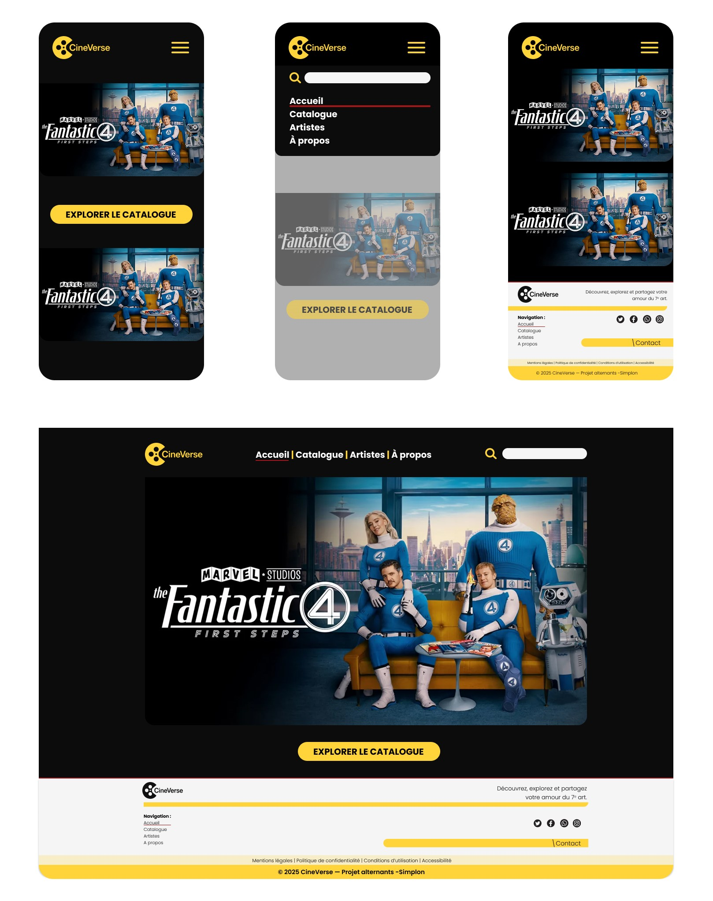

# CineVerse

## Objectif du projet
Le projet **Strapi Cinema** a pour objectif de concevoir une **API complète** pour la gestion de données cinématographiques (*films, réalisateurs, acteurs*) à l’aide d’un **CMS headless : Strapi**.  

L’API doit interagir avec **The Movie Database (TMDb)** afin d’importer automatiquement des films et acteurs, enrichir les données localement et les exposer via des **endpoints REST sécurisés**.

## Maquettes haute fidélité


---

## Technologies & ressources
API & back-office : Strapi (Node.js)  
Données externes : TMDb API  
CI/CD :	GitHub Actions (lint, tests, build)  
Front-end vitrine : HTML5, CSS3, JavaScript  
Design & prototypage : Figma  
Base de données : SQLite  

## Contexte
La société **CineVerse**, spécialisée dans la **production et la distribution de films**, souhaite moderniser la gestion de son **catalogue de films, réalisateurs et acteurs**.  
Jusqu’à présent, les informations étaient réparties entre plusieurs outils non connectés, rendant toute **mise à jour** ou **synchronisation** complexe et chronophage.

Pour remédier à ces difficultés, CineVerse a décidé de mettre en place un **système centralisé et automatisé** basé sur un **CMS headless : Strapi**.  

Ce système a pour vocation de :
- **Importer automatiquement** des données cinématographiques publiques depuis **The Movie Database (TMDb)**,  
- **Centraliser, structurer et enrichir** ces données dans une base locale,  
- **Offrir une API interne sécurisée** pour faciliter la consultation, la recherche et l’intégration des contenus dans différents supports.

## Architecture du projet
```bash
nnm-strapi-cinema/
├── backend/                → Projet Strapi (CMS headless)
│   └── README.md           → Documentation technique du back-end
├── frontend/               → Interface utilisateur (HTML / CSS / JS)
│   └── README.md           → Documentation front-end
├── docs/                   → Documentation du projet (personas, user journeys, maquettes)
│   ├── PERSONA.md
│   ├── USER_JOURNEYS.md
│   ├── Endpoints.md
│   ├── charte_graphique/
│   │   └── Charte_graphique.jpg
│   └── maquettes/
│       └── Maquette_haute_fidelite.jpg
├── .github/workflows/      → Workflows CI/CD (lint, tests, build)
├── assets/                 → Personas, maquettes, wireframes globaux
└── README.md               → README global du projet
```
## Déploiement  

### Étapes du workflow CI :
1. **Installation** des dépendances du back-end et du front-end  
2. **Analyse du code** (lint)  
3. **Exécution des tests** (unitaires et fonctionnels)  
4. **Build des projets** pour vérifier la stabilité  

##  Husky
Nous utilisons **Husky** pour automatiser certaines vérifications avant les commits, comme le lint et les tests.  
Les hooks Git sont configurés pour s’exécuter **automatiquement** lors des actions Git, garantissant ainsi la qualité du code tout au long du développement. 


