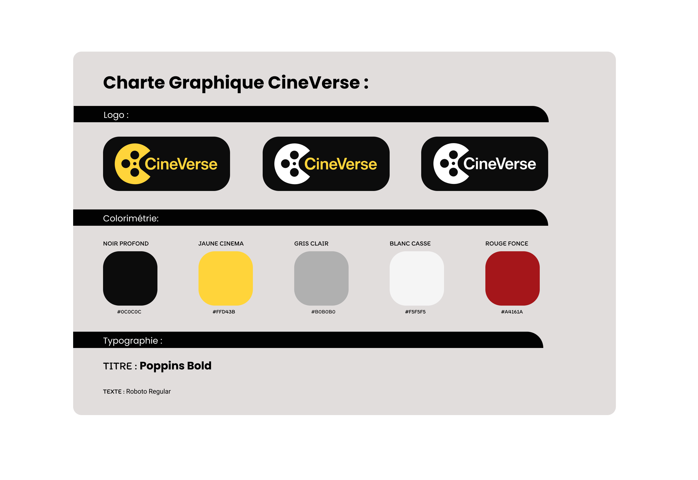

# CineVerse — Front-end (Vitrine)

## Objectif du front-end  

Le front-end du projet **CineVerse** a pour objectif de proposer une **interface vitrine** permettant de visualiser et de parcourir les **films** et **acteurs** gérés par le back-end Strapi.

Cette interface permet :
- de **présenter le catalogue** des films importés depuis TMDb,
- d’**afficher dynamiquement** les informations issues de l’API Strapi,
- de **valoriser l’expérience utilisateur** à travers un design responsive et épuré.

---
## Charte Graphique 


## Charte Colorimétrique  
1. Noir profond : #0C0C0C  
2. Jaune cinéma : #FFD43B  
3. Gris clair : #B0B0B0  
4. Blanc cassé : #F5F5F5  
5. Rouge foncé : #A4161A  

## Charte Typographique 
Titre : Poppins Bold  
Texte : Roboto Regular  

---

## Architecture du projet  
```bash
frontend/
├── index.html              → Page d’accueil
├── catalogue.html          → Page du catalogue de films
├── artistes.html           → Page des artistes
├── film.html               → Page de détail d’un film
├── search.html             → Page de recherche
├── contact.html            → Page de contact
├── apropos.html            → Page "À propos"
├── config.js               → Fichier de configuration globale (ex: base URL de l’API)
├── README.md               → Documentation du front
│
└── src/
    ├── assets/             → Images et ressources graphiques (logos, favicon, etc.)
    │   ├── CineVerse.png
    │   ├── CineVerse.svg
    │   ├── CineVerse_black.svg
    │   ├── favicon.jpg
    │   └── placeholder.webp
    │
    ├── scripts/            → Code JavaScript du projet
    │   ├── api/            → Fonctions pour consommer l’API Strapi (films, artistes, recherche)
    │   │   ├── api_artistes.js
    │   │   ├── api_catalogue.js
    │   │   ├── api_detail_movie.js
    │   │   ├── api_index.js
    │   │   └── api_search.js
    │   │
    │   ├── services/       → Fonctions utilitaires ou services spécifiques
    │   │   └── artisteListService.js
    │   │
    │   ├── ui/             → Scripts d’interaction et de rendu côté interface
    │   │   ├── film.js
    │   │   ├── index.js
    │   │   └── search.js
    │   │
    │   ├── header.js       → Injection dynamique du header commun
    │   ├── footer.js       → Injection dynamique du footer commun
    │   └── initswiper.js   → Initialisation du carrousel Swiper
    │
    └── styles/             → Feuilles de style globales et spécifiques à chaque page
        ├── header.css
        ├── footer.css
        ├── home.css
        ├── catalogue.css
        ├── artistes.css
        ├── film.css
        ├── search.css
        ├── contact.css
        ├── apropos.css
        └── styles.css      → Style global de base
```